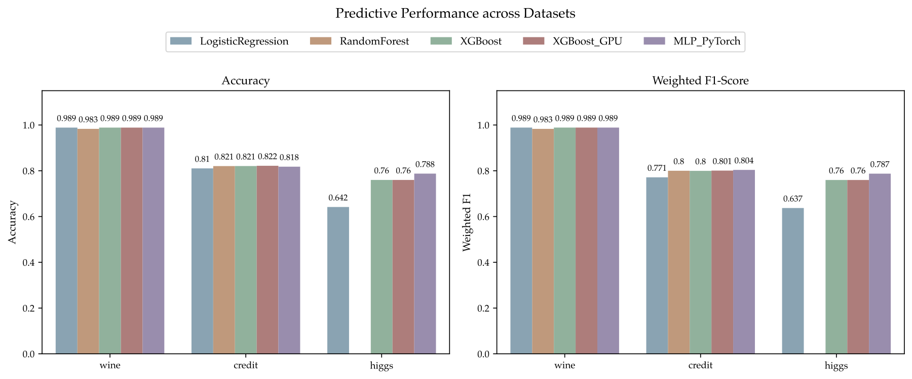
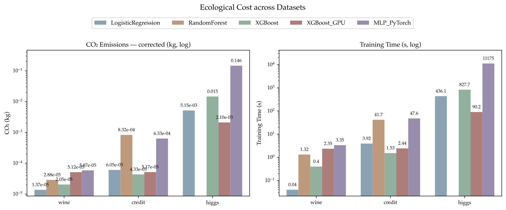
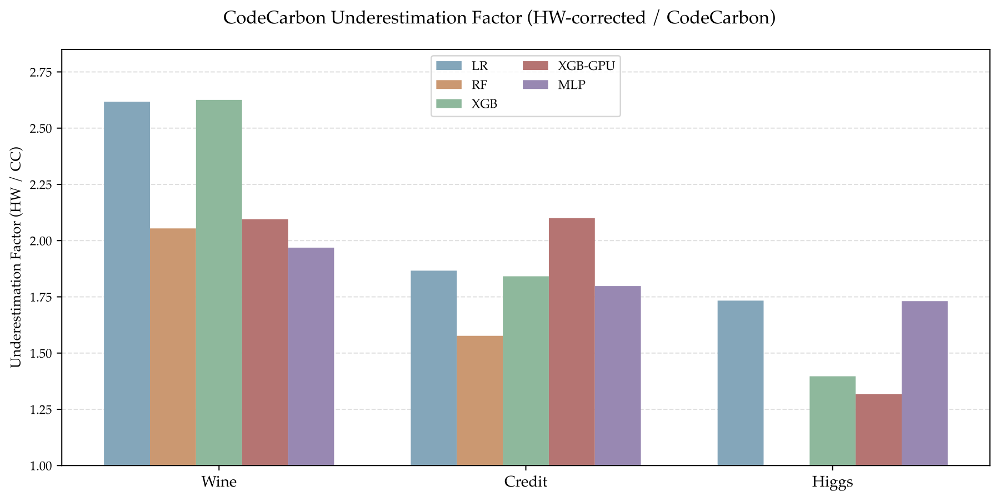
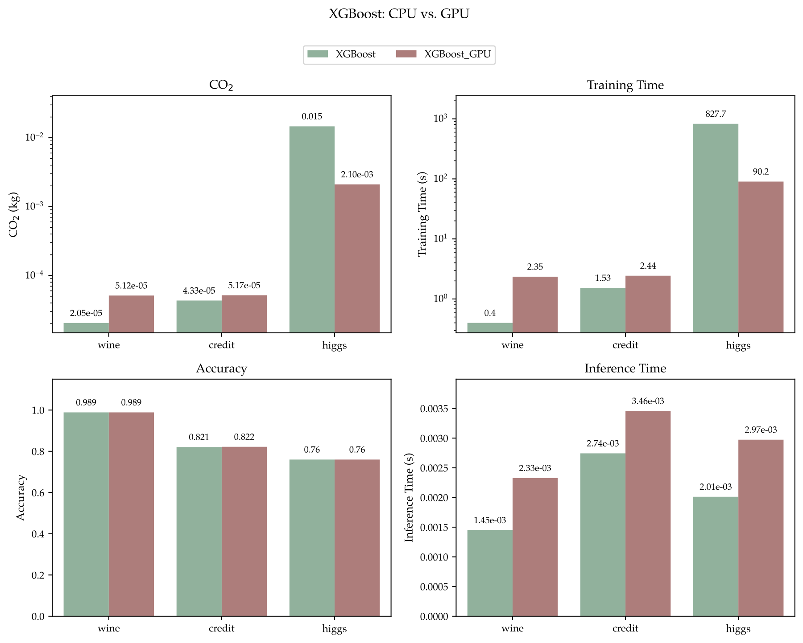
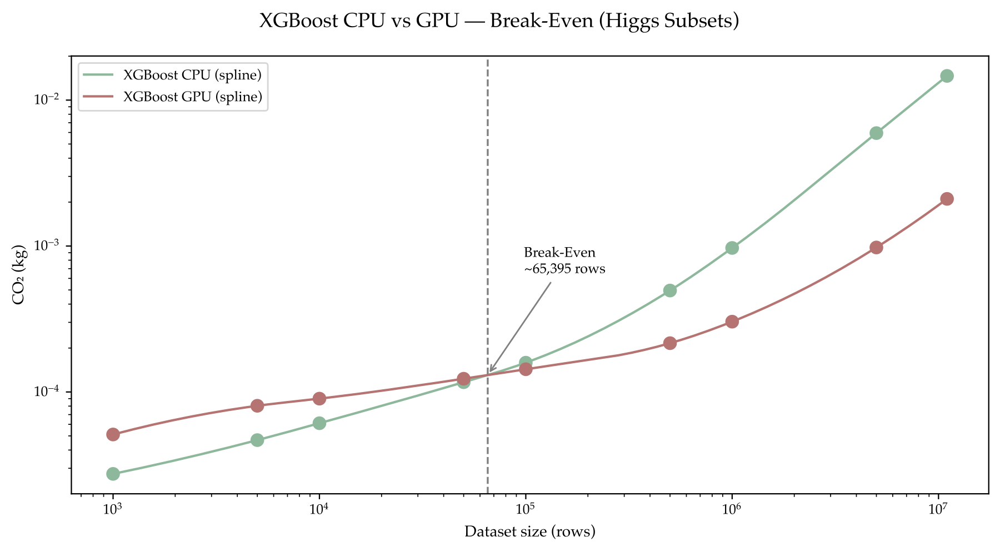
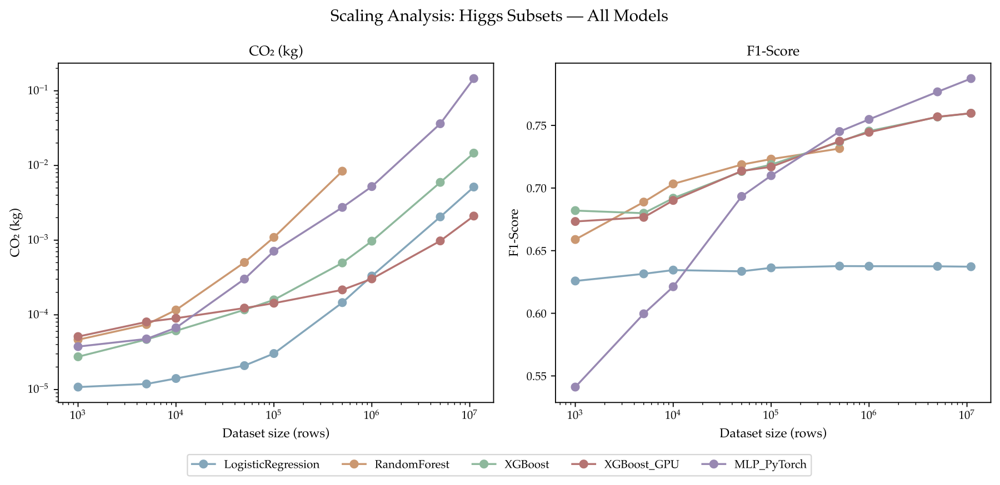
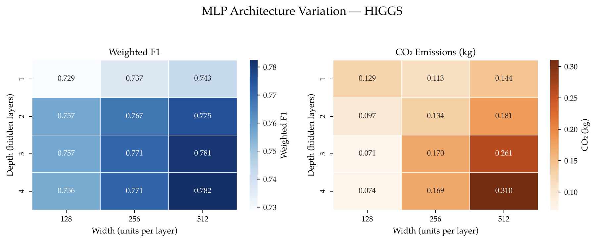
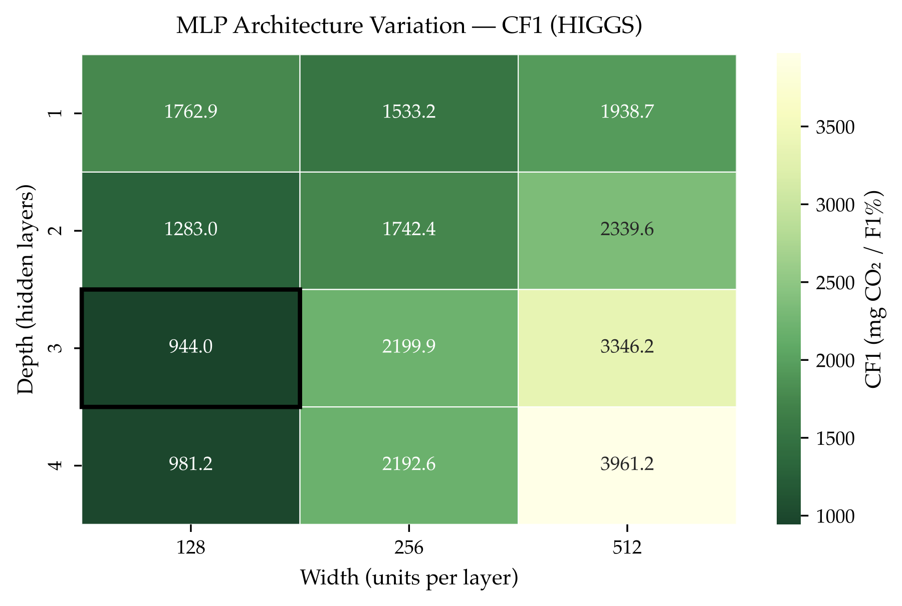
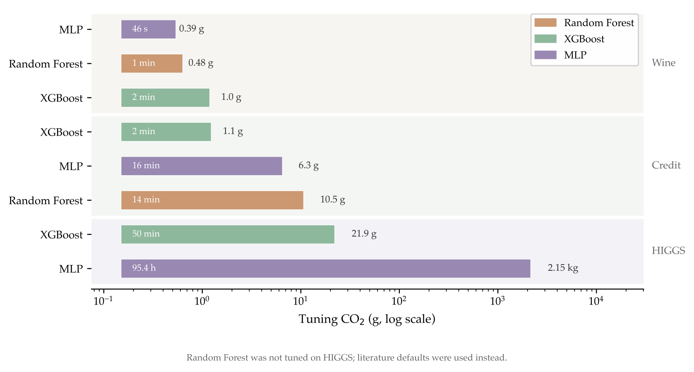
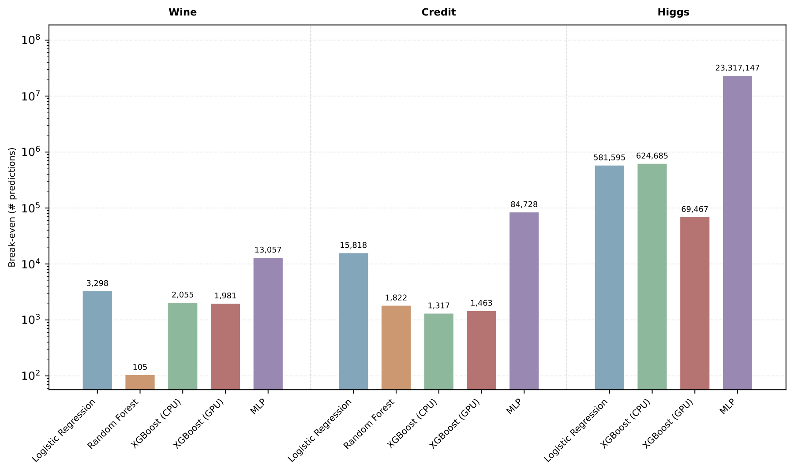

# Ecological Efficiency of Classification Algorithms

Benchmarking the ecological efficiency of ML classification algorithms (Logistic Regression, Random Forest, XGBoost CPU/GPU, MLP) across three datasets of varying scale (Wine, Credit Card Default, HIGGS). Metrics tracked: accuracy, weighted F1, CO₂ emissions, training time, and inference latency.

## Setup

```bash
pip install -r requirements.txt
```

> **Note:** Must be run as Administrator on Windows (right-click → "Run as administrator") for accurate CPU power measurement via LibreHardwareMonitor.

## Datasets

Download manually and place at:

| Dataset | Path | Source |
|---|---|---|
| Wine | `csv_files/wine/wine.data` | [UCI](https://archive.ics.uci.edu/dataset/109/wine) |
| Credit Card Default | `csv_files/default_of_credit_card_clients/` | [UCI](https://archive.ics.uci.edu/dataset/350/default+of+credit+card+clients) |
| HIGGS | `csv_files/higgs/higgs.parquet` | [UCI](https://archive.ics.uci.edu/dataset/280/higgs) |

## Running the Scripts

### Full pipeline

```bash
python scripts/run_all.py           # tune → train all models on all datasets
python scripts/run_all_test.py      # smoke test: TEST_NROWS=5000, N_TRIALS=5, ~5–10 min
```

### Individual models

```bash
python models/log_regression.py [wine|credit|higgs]
python models/random_forest.py  [wine|credit|higgs]
python models/xgboost_cpu.py    [wine|credit|higgs]
python models/xgboost_gpu.py    [wine|credit|higgs]   # requires CUDA
python models/mlp.py            [wine|credit|higgs]
```

Default dataset is `wine` if no argument is given. Each script performs a stratified 80/20 train–test split, fits on the training partition, and evaluates on the held-out test set.

### Hyperparameter tuning

```bash
python models/tune/tune_xgb.py [dataset]
python models/tune/tune_rfc.py [dataset]
python models/tune/tune_mlp.py [dataset]
```

Tuning runs 40 Optuna trials by default (`N_TRIALS` env var overrides). All tuning operates exclusively on the training partition. Best parameters are saved to `models/best_params.json`.

## Experiment Scripts

```bash
python scripts/run_scaling_all_models.py      # all models on HIGGS subsets — dataset-size scaling
python scripts/run_xgb_breakeven.py           # XGBoost CPU vs GPU on HIGGS subsets — CO₂ crossover
python scripts/run_mlp_variation.py           # 12 MLP configs (3 widths × 4 depths) on HIGGS
python scripts/run_mlp_variation_and_scaling.py  # combined MLP variation + scaling run
python scripts/run_inference_power.py         # measure per-sample inference latency and CPU power
python scripts/run_lifecycle_analysis.py      # break-even: training CO₂ vs cumulative inference CO₂
python scripts/run_carbon_intensity_analysis.py  # temporal carbon intensity (ElectricityMaps API, requires .env key)
```

## Results

Results are appended to `results/results.csv` (never overwritten — check for duplicates when re-running).

| Column | Description |
|---|---|
| `timestamp` | Date and time of the run |
| `model` | Model name |
| `dataset` | Dataset name |
| `nrows` | Subset size; `all` for full dataset |
| `accuracy` | Test-set accuracy |
| `f1` | Test-set weighted F1 |
| `co2eq_kg` | Corrected CO₂ (HardwareMonitor CPU + CodeCarbon GPU + RAM) |
| `co2eq_codecarbon_kg` | Original CodeCarbon estimate (for comparison) |
| `cpu_power_hw_w` | Average CPU package power in W (HardwareMonitor) |
| `cpu_energy_hw_wh` | CPU energy in Wh (HardwareMonitor) |
| `gpu_energy_wh` | GPU energy in Wh (CodeCarbon / NVML) |
| `ram_energy_wh` | RAM energy in Wh (CodeCarbon) |
| `training_time_s` | Training duration in seconds |

Inference latency is stored separately in `results/inference_time.csv`.

## Analysis Plots

High-resolution PDFs are in `analysis/plots/`. PNGs for quick preview are in `readme_pngs/`.

### Predictive Performance



### Ecological Cost (CO₂ + Training Time)



### CodeCarbon vs Hardware-Sensor CO₂



### XGBoost CPU vs GPU



### XGBoost CPU/GPU CO₂ Break-Even (HIGGS Scaling)



### Dataset-Size Scaling — All Models on HIGGS



### MLP Architecture Variation




### Tuning Costs (HPO Emissions)



### Lifecycle Break-Even (Training vs Cumulative Inference CO₂)


