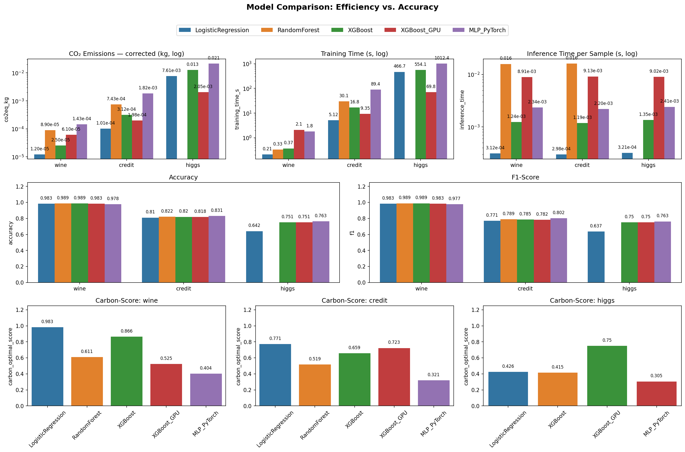
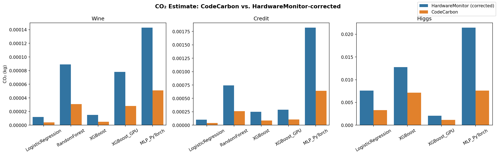
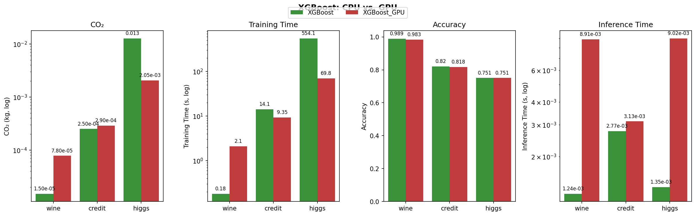
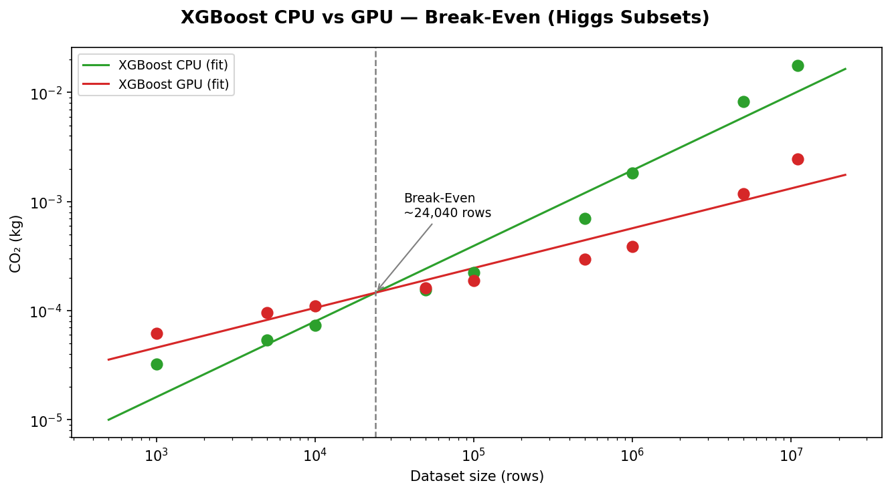
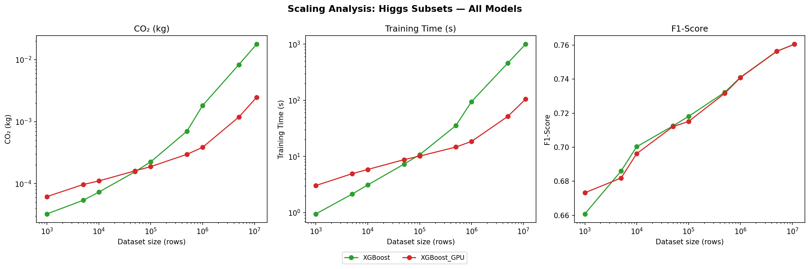
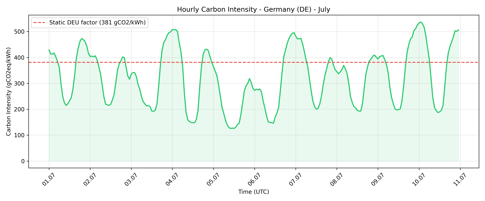
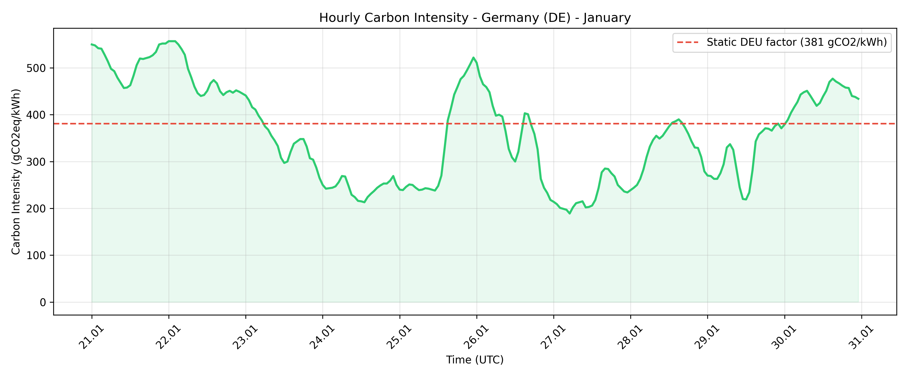
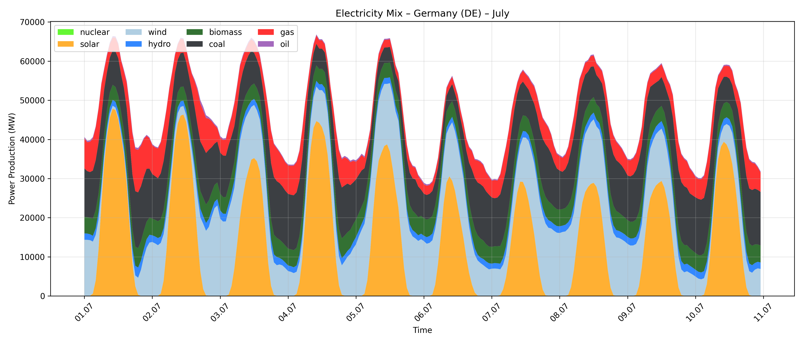
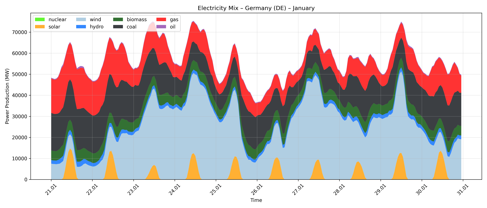

# Ecological Efficiency of Classification Algorithms

Benchmarking the ecological efficiency of ML classification algorithms (Logistic Regression, Random Forest, XGBoost CPU/GPU, MLP) across three datasets of varying scale (Wine, Credit Card Default, HIGGS). Metrics tracked: accuracy, weighted F1, CO₂ emissions, training time, and inference latency.

## Setup

```bash
pip install -r requirements.txt
```

> **Note:** Must be run as Administrator on Windows (right-click → "Run as administrator") for accurate CPU power measurement via LibreHardwareMonitor.

## Datasets

Download manually and place at:

| Dataset | Path | Source |
|---|---|---|
| Wine | `csv_files/wine/wine.data` | [UCI](https://archive.ics.uci.edu/dataset/109/wine) |
| Credit Card Default | `csv_files/default_of_credit_card_clients/` | [UCI](https://archive.ics.uci.edu/dataset/350/default+of+credit+card+clients) |
| HIGGS | `csv_files/higgs/higgs.parquet` | [UCI](https://archive.ics.uci.edu/dataset/280/higgs) |

## Running the Scripts

### Full pipeline

```bash
python run_all.py          # tune → train all models on all datasets
python run_all_test.py     # smoke test: 1 trial per script, verifies pipeline without full run
```

### Individual models

```bash
python models/log_regression.py [wine|credit|higgs]
python models/random_forest.py  [wine|credit|higgs]
python models/xgboost_cpu.py    [wine|credit|higgs]
python models/xgboost_gpu.py    [wine|credit|higgs]   # requires CUDA
python models/mlp.py            [wine|credit|higgs]
```

Default dataset is `wine` if no argument is given.

### Hyperparameter tuning

```bash
python models/tune/tune_xgb.py [dataset]          # 40 Optuna trials
python models/tune/tune_rfc.py [dataset]
python models/tune/tune_mlp.py [dataset] --n-trials 20 --max-epochs 20 --patience 5 --tune-sample-size 1000000
```

## Experiment Scripts

```bash
python run_scaling_all_models.py     # all models on HIGGS subsets — dataset-size scaling analysis
python run_xgb_breakeven.py          # XGBoost CPU vs GPU on increasing HIGGS subsets — CO₂ break-even point
python run_mlp_variation.py          # 12 MLP configs (3 widths × 4 depths) on HIGGS — architecture vs emissions
python run_carbon_intensity_analysis.py  # temporal carbon intensity (ElectricityMaps API, requires .env key)
```

## Results

Results are appended to `results/results.csv` (never overwritten — check for duplicates when re-running).

| Column | Description |
|---|---|
| `co2eq_kg` | Corrected CO₂ (HardwareMonitor CPU + CodeCarbon GPU + RAM) |
| `co2eq_codecarbon_kg` | Original CodeCarbon estimate (for comparison) |
| `cpu_power_hw_w` | Average CPU package power in W (HardwareMonitor) |
| `cpu_energy_hw_wh` | CPU energy in Wh (HardwareMonitor) |
| `training_time_s` | Training duration in seconds |

### Model comparison



### CodeCarbon vs hardware measurement



### XGBoost CPU vs GPU



### XGBoost CPU/GPU CO₂ break-even (HIGGS scaling)



### HIGGS dataset-size scaling (all models)



### German grid carbon intensity (seasonal)




### German electricity mix



