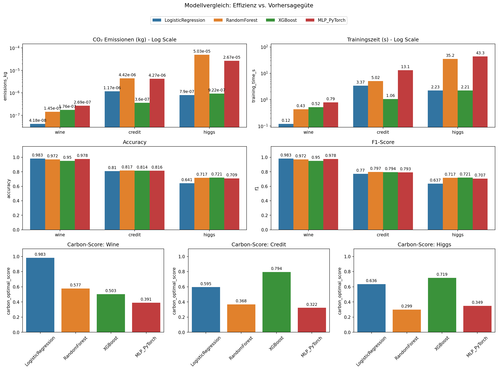

# Ecological Efficiency of Classification Algorithms

## Setup

First, install the required dependencies:

```bash
pip install -r requirements.txt
```

## Datasets

The datasets need to be downloaded manually and placed in the following folder structures:

* **Wine:** `wine/wine.data` → [UCI Download](https://archive.ics.uci.edu/dataset/109/wine)
* **Credit Card Clients:** `default_of_credit_card_clients/` → [UCI Download](https://archive.ics.uci.edu/dataset/350/default+of+credit+card+clients)
* **HIGGS:** `higgs/higgs.parquet` → [UCI Download](https://archive.ics.uci.edu/dataset/280/higgs)

## Running the Scripts

You can run each model individually for a specific dataset by passing the dataset name as an argument:

```bash
python models/log_regression.py wine
python models/random_forest.py credit
python models/xgboost_cpu.py higgs
python models/xgboost_gpu.py wine
python models/mlp.py credit
```

Valid dataset options are: wine, credit, higgs. If no argument is provided, the scripts default to wine.

To run the full pipeline (tuning → training) across all models and datasets:

```bash
python run_all.py
```

> **Note:** Must be run as Administrator (right-click → "Run as administrator") for accurate CPU power measurement via LibreHardwareMonitor.

## Results

Results are written to `results/results.csv` with the following columns:

| Column | Description |
|---|---|
| `co2eq_kg` | Corrected CO₂ (HardwareMonitor CPU + CodeCarbon GPU + RAM) |
| `co2eq_codecarbon_kg` | Original CodeCarbon estimate (for comparison) |
| `cpu_power_hw_w` | Average CPU package power in W (HardwareMonitor) |
| `cpu_energy_hw_wh` | CPU energy in Wh (HardwareMonitor) |
| `training_time_s` | Training duration in seconds |

